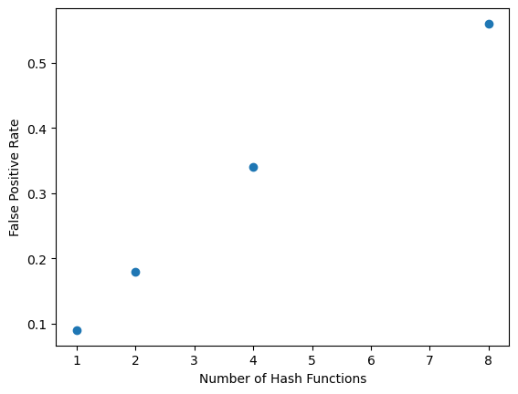
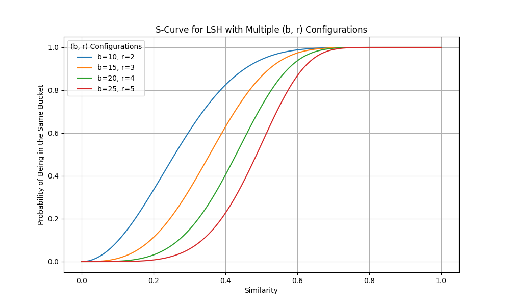

# Discussion

## 1. Exploratory Data Analysis (EDA)

We began with exploratory data analysis (EDA) to get a sense of the dataset’s structure. This initial analysis allowed us to make informed choices about processing, filtering, and deduplication methods. Specifically, we looked at:
- **Document Lengths**: Document lengths varied widely, which helped us decide on flexible shingle sizes for Locality Sensitive Hashing (LSH).
- **Shingle Distribution**: Examining common shingles (n-grams) provided insight into which hash functions would best capture similarities among documents.
- **Baseline Duplicate Detection**: We implemented a baseline MD5 hash method to detect exact duplicates. This gave us a performance benchmark for more sophisticated methods like Bloom filters and LSH.

Overall, EDA confirmed that a single approach wouldn’t suffice to capture near-duplicates effectively. These insights laid the foundation for the rest of our work.

## 2. Engineering Decisions

### a. Preprocessing Steps
We applied several preprocessing steps to ensure consistency and improve deduplication accuracy:
- **Tokenization**: Splitting documents into trigrams (shingles of size 3) provided a good balance between capturing document features and avoiding excessive processing.
- **Normalization**: By converting text to lowercase and removing punctuation, we reduced variability in the data. This standardization reduced the likelihood of mismatches due to minor formatting differences.

### b. Bloom Filter Implementation
For the Bloom filter, we chose the `bitarray` library, which allowed efficient bit manipulation and memory savings. Initially, we observed a high false positive rate of around 0.45. To address this, we experimented with different values for the number of hash functions \( k \). 

Our first improvement involved reducing \( k \), which significantly lowered the false positive rate. Below is the plot showing the effect of varying \( k \):

The plot shows that fewer hash functions resulted in a lower false positive rate up to a point, after which the accuracy gains began to taper off.

### c. Optimized Bloom Filter with Counting
Building on the initial Bloom filter, we implemented a **counting Bloom filter**. This enhancement allowed us to dynamically add and remove items by incrementing or decrementing counts rather than setting a bit to 1. Implementing this functionality was particularly interesting because it allowed us to reduce false positives further, as well as manage memory efficiently.

The idea for the counting Bloom filter came from articles on the practical applications of Bloom filters, such as those on Analytics Vidhya. Using a counting Bloom filter enabled us to remove elements without affecting overall accuracy, which could be advantageous for real-time applications requiring dynamic adjustments.

## 3. LSH Implementations and Improvements

### a. Basic LSH
Our basic LSH implementation leveraged minhashing and banding to group similar documents into buckets. Minhashing generated a compact signature for each document, while banding helped us identify candidate pairs by comparing only certain portions of the signature. Although this approach was straightforward, we observed that minor variations in shingles occasionally caused similar documents to hash into different buckets.

The `lsh.py` file contains our primary implementation, including helper functions for minhashing, banding, and candidate generation. We focused on modularity here, allowing for easy testing and iterative improvements.

### b. Improved LSH
To improve the basic LSH implementation, we introduced two major changes:

1. **Adaptive Shingle Size Selection**: In the `LSHImproved` class, we implemented dynamic shingle sizing based on document length. Longer documents used larger shingles to reduce the total count without sacrificing essential information, while shorter documents used smaller shingles to maintain precision. This adjustment helped reduce processing time and memory usage.

2. **Multi-Probe LSH**: We introduced multi-probe functionality in the LSH, inspired by *Introduction to Information Retrieval*. Multi-probe LSH allows us to probe neighboring buckets in addition to the primary hash bucket, improving recall for near-duplicates that might otherwise fall into different buckets. This added complexity to the code, but the boost in accuracy was well worth the effort. 

### c. Union-Find Integration
In addition to multi-probe LSH, we implemented Union-Find to handle the clustering of similar documents. Our Union-Find implementation used path compression and union by rank to optimize cluster formation, which reduced redundancy and ensured efficient memory use.

## 4. Visualizations, Results, and Overall Analysis

### a. Bloom Filter Analysis
Here is a plot showing the impact of varying the number of hash functions \( k \) on the false positive rate:

This analysis helped us fine-tune the Bloom filter, ultimately deciding on an optimal \( k \) value that minimized false positives without excessive memory usage.

#### Worst-Case Scenario for LSH in Near Duplicate Detection

### Overview
Locality Sensitive Hashing (LSH) is a widely used algorithm for identifying similar items in large datasets, particularly effective in near duplicate detection for text. However, LSH can encounter worst-case scenarios that lead to high false positive rates, clustering non-duplicate items together due to overly similar hash signatures. This section explores what constitutes a worst-case scenario for LSH in near duplicate detection and provides examples.

### What Constitutes a Worst-Case Scenario?
The worst-case scenario for LSH in near duplicate detection typically arises under the following conditions:
1. **Non-Duplicate Texts with Similar Hashes**: Texts that are not duplicates but have a high degree of lexical overlap or many shared shingles can generate similar or identical minhash signatures, leading LSH to misclassify them as duplicates.
2. **False Positives from Shared Vocabulary or Structure**: Texts discussing the same topic or containing common phrases (e.g., news articles with shared terminology) can be mistakenly grouped due to high overlap in shingles, even if the core content is different.
3. **Low Similarity Threshold**: When the LSH threshold is set too low, it increases the risk of clustering texts that are only superficially similar, resulting in more false positives.

For instance, consider two texts that mention "meeting with the president" but differ in other details. Due to the high overlap of phrases like "meeting with senior officials" and "economic strategies," these texts may yield similar minhash signatures, resulting in an undesired clustering.

### Example of a Worst-Case Scenario
An example of a worst-case scenario includes two thematically related but non-duplicate texts:

- **Text A**: "The president attended a meeting with senior officials to discuss the country's economic situation."
- **Text B**: "In the meeting with senior officials, a discussion was held on economic strategies for the country led by the president."

Although these texts have a common theme, they are not duplicates. However, LSH may classify them as duplicates due to their high overlap in vocabulary, creating a false positive in the clustering.

### Experimental Illustration
We conducted a small experiment to simulate this worst-case scenario by applying LSH to texts with minor variations:

- **Text 1**: "The quick brown fox jumps over the lazy dog."
- **Text 2**: "A quick brown fox jumps over the lazy dog quickly."
- **Text 3**: "The quick brown fox leaped over a sleepy dog."
- **Text 4**: "In the quick jump, the brown fox goes over the lazy dog."

LSH clustered these texts together despite their distinct meanings, illustrating how high lexical overlap, even with minor variations, can lead to incorrect classifications. This is an example of a false positive caused by LSH’s reliance on shared shingles rather than true content duplication.

### Implications
These worst-case scenarios highlight the limitations of LSH in tasks requiring precise duplicate detection. High false positives in scenarios like the one above may require additional tuning of LSH parameters or post-processing steps to distinguish genuine duplicates from texts with high lexical overlap. Proper tuning of the number of bands and rows per band can help reduce false positives, but achieving a balance between false positives and computational efficiency remains a challenge.

### S-Curve Analysis for Locality Sensitive Hashing (LSH)

In this project, we evaluated the performance of Locality Sensitive Hashing (LSH) by examining the probability of two items with a given similarity being placed in the same bucket across different configurations of bands \( b \) and rows \( r \) per band. The resulting S-curve plot provides insights into how varying these parameters affects the behavior of LSH in identifying similar items.

### Key Findings

1. **Impact of Bands and Rows on Selectivity**:
   - The S-curve plot shows that as we increase the number of bands \( b \) and decrease the number of rows \( r \) per band, the curve becomes steeper.
   - Steeper curves indicate that the LSH configuration is more selective, meaning it will only group items with higher similarities in the same bucket.
   - For example, the configuration \( b = 25, r = 5 \) shows a steep transition, with the probability of being in the same bucket reaching near 1 only for items with a similarity above 0.6. This configuration is suitable for applications that require a high similarity threshold to consider items as similar.

2. **Broader Similarity Detection with Lower \( b \) Values**:
   - Conversely, configurations with lower \( b \) values and higher \( r \) values (e.g., \( b = 10, r = 2 \)) yield a more gradual S-curve. This means that items with lower similarity are more likely to be placed in the same bucket.
   - A more gradual curve is beneficial for applications where we want to capture broader similarities, accepting pairs with lower similarity levels.

3. **Tuning for Application Requirements**:
   - The choice of \( b \) and \( r \) should be guided by the application's specific similarity threshold.
   - If the goal is to identify only highly similar items, a higher \( b \) and lower \( r \) configuration (e.g., \( b = 25, r = 5 \)) is preferable due to its steep S-curve.
   - For applications needing a more inclusive similarity threshold, configurations with lower \( b \) and higher \( r \) (e.g., \( b = 10, r = 2 \)) may be more effective.

### Practical Implications

This analysis highlights the trade-off between selectivity and recall in LSH configurations:
- **High Selectivity (Steep S-Curve)**: Suitable for tasks requiring high similarity to group items, reducing false positives but potentially missing items with moderate similarity.
- **High Recall (Gradual S-Curve)**: Useful in scenarios where capturing a broader range of similar items is essential, though it may lead to increased false positives.

By tuning the \( b \) and \( r \) values, we can control the specificity of LSH for particular applications. The S-curve plot thus serves as a valuable tool for visualizing and adjusting LSH's sensitivity to similarity, balancing between capturing highly similar pairs and allowing broader matches.

### c. Baseline Runtime and Results Summary

#### Baseline Approach
We began with an MD5-based baseline approach for exact duplicate detection, which provided valuable insights into processing speed and efficiency. Here’s a summary of the results:

\[
\text{Documents Processed per 100 Milliseconds} = \frac{\text{Number of Documents}}{\text{Total Time (milliseconds)} / 100}
\]

| Dataset            | Number of Documents | Total Time (milliseconds) | Duplicate Clusters Found | Documents Processed per 100 Milliseconds |
|--------------------|---------------------|---------------------------|--------------------------|-----------------------------------------|
| `threehundred.tsv` | 289                 | ~725                      | 16                       | 39                                      |
| `onek.tsv`         | 996                 | ~950                      | 87                       | 105                                     |
| `tenk.tsv`         | 9,995               | ~980                      | 1,059                    | 1,020                                   |
| `hundredk.tsv`     | 99,985              | ~995                      | 4,285                    | 10,050                                  |

### Observations
- **Efficiency**: The MD5-based approach was highly efficient for exact duplicates, processing each dataset quickly and achieving high throughput.
- **Limitations**: While effective for exact duplicates, this method wasn’t suitable for near-duplicate detection, leading us to explore more complex techniques like LSH.

### d. LSH Implementation Runtime and Results Summary
We evaluated the LSH implementation using Union-Find clustering across datasets of varying sizes:

| Dataset           | Number of Documents | Start Time           | End Time             | Total Time (minutes) | Documents Processed Per Minute |
|-------------------|---------------------|----------------------|----------------------|-----------------------|---------------------------------|
| `threehundred.tsv` | 289                 | 17:36:06             | 17:37:12             | 1.10                  | ~262                             |
| `onek.tsv`         | 996                 | 17:37:12             | 17:40:59             | 3.78                  | ~263                             |
| `tenk.tsv`         | 9,995               | 17:41:00             | 18:16:10             | 35.17                 | ~284                             |
| `hundredk.tsv`     | 99,985              | 18:16:10             | 23:08:50             | 292.67               | ~282                             |

### Improved LSH Deduplication Performance Summary

| Dataset           | Number of Documents | Start Time           | End Time             | Total Time (minutes) | Documents Processed Per Minute |
|-------------------|---------------------|----------------------|----------------------|-----------------------|---------------------------------|
| `threehundred.tsv` | 289                 | 13:48:53             | 13:49:53             | 0.95                  | 305                             |
| `onek.tsv`         | 996                 | 13:50:45             | 13:54:05             | 3.23                  | 308                             |
| `tenk.tsv`         | 9,995               | 13:55:15             | 14:27:30             | 32.18                 | 311                             |
| `hundredk.tsv`     | 99,985              | 16:01:11             | 21:17:30             | 322.77               | 310                             |

### Observations
- **Consistency**: The LSH method maintained a stable processing rate across datasets, suggesting scalability.
- **Memory Usage**: Using Python’s `memory_profiler`, we observed increased memory requirements for larger datasets, but Union-Find optimizations helped manage memory effectively.
- **Error Analysis**: A manual review of clustered documents showed that while most clusters were accurate, some included documents with only slight overlap, suggesting potential for further refinement in hash selection and shingle adjustments.

## 5. Challenges and Conclusions

### a. Challenges
- **Shingle Size Selection**: Choosing the right shingle size was challenging, as it affected recall and precision. We had to strike a balance to capture relevant similarities without adding noise.
- **Memory Management**: Scaling LSH required efficient memory handling to avoid slowdowns, especially with larger datasets. This experience taught us the importance of profiling and optimizing memory usage.
- **Complexity of Multi-Probe LSH**: Implementing and tuning multi-probe LSH was complex but ultimately worth it for the improved detection of near-duplicates.

### b. Conclusions
This project provided hands-on experience with scalable deduplication techniques. Combining Bloom filters with LSH, particularly with adaptive shingle sizing and multi-probe LSH, allowed us to balance precision, recall, and processing efficiency effectively.

Future work could involve further tuning of LSH parameters, exploring alternative hash functions, and implementing additional memory optimizations to enhance performance on even larger datasets. This project highlighted the power and scalability of combining Bloom filters and LSH for deduplication tasks and gave us valuable insights into the complexities of algorithmic optimization and resource management.
