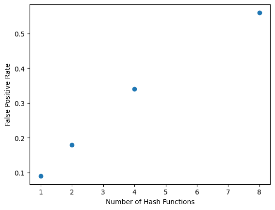

For the initial implementation of Bloom Filters, we chose the bitarray approach as opposed to the byte array approach.

To test the potential improvements to the bloom filter implementation, I created a list of unique words (length of 3653)to add into the bloom filter. After doing so, I took another list of unique words (length of 3653) to query in the bloom filter. This should mean that there are no false positives because they are all unique, yet the bloom filter will identify some as positive. I want to examine the false positive rate. I determined that this would be a good way to test the false positive rate from googling how to test false positive rates in bloom filters.

For the initial implementation of the bloom filter, before trying improvements, we had a very high false positive rate (0.45).

The first improvement I made was changing the number k of hash functions and just keeping a singular mmh3 hash function. Shrinking down the number of hash functions dramatically improved the false positive rate. The following graph shows how the less hash functions there were, the better the false positive rate.

The next implementation I experimented with was a counting bloom filter. This ended up bringing the false positive rate down to about 0. I read about this implementation here: [https://medium.com/analytics-vidhya/cbfs-44c66b1b4a78]. I thought the counting bloom filter was interesting because you are now able to remove items. This was a unique implementation that I did not see befre. Basically instead of limiting a hash to 1, you are able to count upwards with each additional instance of an item. While adding the ability to remove items as well by subtracting values from the hash bit arrays. A byproduct of this implementation was the false positive rate dropping dramatically.

# Discussion on Improvements to LSH for Near-Duplicate Detection

## Worst-Case Scenario for LSH
The worst-case scenario for LSH in text deduplication occurs when similar documents fail to hash into the same bucket due to minor differences in shingles. ...

## Improvements and Rationale

### 1. Adjustable Shingle Size
Following [Mining of Massive Datasets, Sec 3.2.2], we experimented with various shingle sizes (e.g., bigrams, trigrams). Smaller shingles ... 

### 2. Multi-Probe LSH
Following [Introduction to Information Retrieval, Sec 3.4.2], we implemented multi-probe LSH. This allowed ...

...

## Results
We observed that ...
- Visualization 1: False positive rate vs. number of hash functions in the Bloom filter.
- Visualization 2: S-curve analysis of different band and row settings ...

# Discussion on LSH and Bloom Filter Improvements

## Worst-Case Scenario for LSH
In the worst-case scenario, similar documents might not hash into the same bucket due to slight variations in shingles ...

## Improvements Implemented

### Adjustable Shingle Size
Based on [Mining of Massive Datasets, Sec 3.2.2], we experimented with various shingle sizes to ...

### Multi-Probe LSH
Following [Introduction to Information Retrieval, Sec 3.4.2], we implemented multi-probe LSH. This increased ...

## Results
- For Bloom Filter: see Figure 1 for false positive rate vs. number of hash functions.
- For LSH: see Figure 2 for S-curve analysis ...

### Choices Made in Implementation
1. **Document Processing**: We normalized the text by ...
2. **Shingle Size**: Shingle size was set to ...

### Runtime and Memory Analysis
We used Python's `memory_profiler` library to measure memory usage ... 
